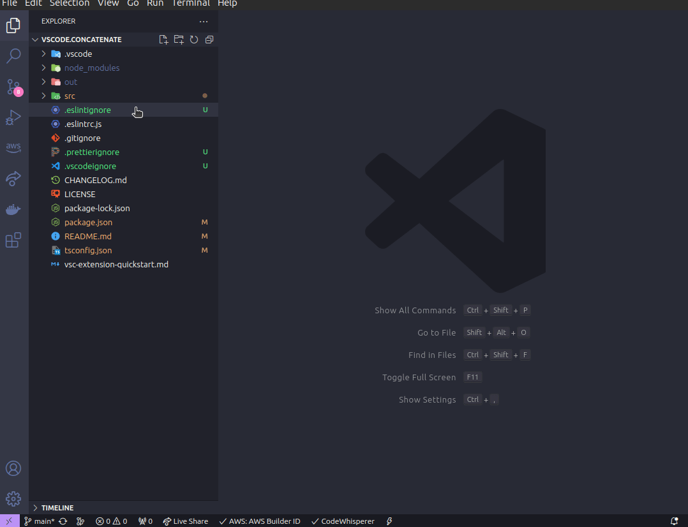
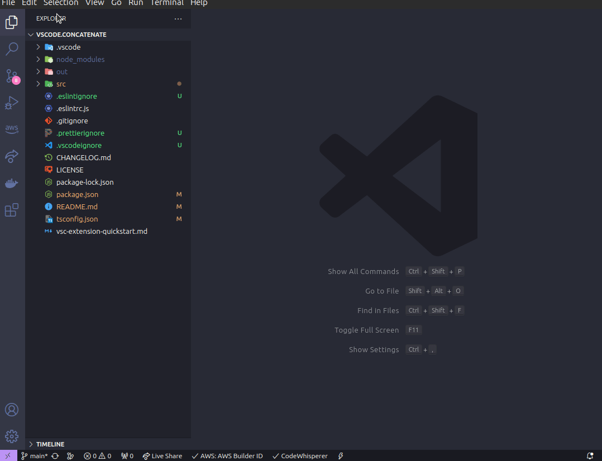

# Concatenate files

This extension allows you to select two or more files and generate a new file in the following ways:

- New window: Allow you to copy the generated content
- New document: Will create a new document with concatenated content

## Features

### Concatenate selected files

- Install the extension
- Select the files that you want to concatenate 
- Right click on selected files inside the vscode file explorer and choose **Concatenate selected files**
- The target code will be generated and displayed in new tab

### Concatenate selected files as new document

- Install the extension
- Select the files that you want to concatenate 
- Right click on selected files inside the vscode file explorer and choose **Concatenate selected files as new document**
- The target code will be generated and displayed in new document

